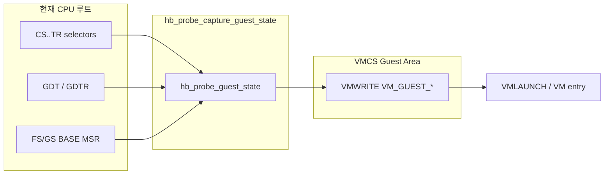

# Guest 세그먼트 — VMCS에 “왜” 이렇게 넣는가

> **세그먼트가 처음이면** [`segment.md` §쉬운 설명](segment.md#쉬운-설명-먼저-읽기) **만 먼저** 읽으세요.

**VM entry** 직전 게스트 VMCS에 `selector` / `base` / `limit` / `access rights` 를 채우는 **이유**와 Hyper-box/hb_probe **전략**을 정리한다.

**x86 기초:** [`segment.md`](segment.md)  
**필드 표:** [`guest.md`](guest.md)

---

## 쉬운 요약

| 질문 | 짧은 답 |
|------|---------|
| 뭘 하는 코드? | 지금 CPU(커널)의 세그먼트 정보를 **게스트 VMCS에 복사** |
| 왜 4개씩? | CPU가 “번호 + 상세 3줄”이 **맞는지** launch 때 검사함 |
| Host 따라가? | **아님.** Guest 영역에 넣는 것 (Host는 exit 후용) |
| 권한 조절? | **1단계는 아님.** 일단 런치 성공이 목표 |

```text
  커널이 이미 쓰는 CS/SS/GDT …  →  복사  →  VM_GUEST_*  →  VMLAUNCH
```

구현 참고:

| 코드 | 역할 |
|------|------|
| [`hb_probe.c`](../../hb_probe.c) `hb_probe_capture_guest_state`, `hb_probe_ldtr_tr_fields` | 프로브용 guest 스냅샷 |
| [`hypervisor.c`](../../../Source/hyper_box/hypervisor.c) `hb_setup_vm_guest_register` | Hyper-box guest 스냅샷 |

---

## 1. 한 줄 요약

| 질문 | 답 |
|------|-----|
| 호스트 설정을 따라가나? | **Host VMCS**가 아니라, **VMLAUNCH 직전 이 CPU(루트/커널)의 아키텍처 상태**를 **Guest VMCS**에 복사한다. |
| 왜 세그먼트를 4종류씩 넣나? | VMX는 게스트 세그먼트를 **레지스터 + GDT 캐시( base/limit/AR )** 로 보관한다. **일관되지 않으면 `VMLAUNCH`/`VM entry` 검사에서 실패**한다. |
| 권한 조정용인가? | **가능은 하다**(AR·CR을 바꾸면 게스트 링/보호가 달라짐). 1단계 목적은 **현재 커널과 맞춰 런치 성공**이 우선. **정책(격리)** 은 VMCS **control**·EPT·exit 핸들러가 더 많이 담당한다. |

세그먼트 용어·selector·GDT·8개 레지스터는 [`segment.md`](segment.md) 참고.

---

## 2. VMX가 요구하는 것 — “캐시된 디스크립터”

Intel SDM **Guest State Area**에는 각 세그먼트마다 다음이 **따로** 있다.

```text
VM_GUEST_CS_SELECTOR   + VM_GUEST_CS_BASE   + VM_GUEST_CS_LIMIT   + VM_GUEST_CS_ACC_RIGHT
… ES, CS, SS, DS, FS, GS, LDTR, TR 동일 패턴
```

### 2.1 왜 selector만 쓰지 않나?

일반 모드 CPU는 selector 변경 시 GDT를 다시 읽지만, **VMX non-root(게스트)** 에서는:

- VM entry 시 **VMCS에 적힌 base/limit/AR가 게스트 세그먼트의 공식 값**이 된다.
- 게스트가 `MOV Sreg` 등으로 selector를 바꾸면, **control field**에 따라 VM exit가 나고 하이퍼바이저가 VMCS를 갱신할 수 있다.

즉 VMCS = **“이 게스트 CPU는 지금 이 세그먼트 캐시를 갖고 있다”** 는 스냅샷이다.

### 2.2 VM entry / VMLAUNCH 검사 (실패하면 launch 안 됨)

대표적으로 CPU는 일관성을 확인한다 (세부는 SDM guest-state checks):

- **CS** — present, code, DPL vs SS RPL, long mode `L`/`D` 비트 등
- **SS** — stack, RPL = CS RPL (일반적으로)
- **TR** — busy TSS 타입, present (사용 시)
- **LDTR** — LDT 타입 또는 **invalid** 인코딩 (`0x10000`)
- **AR** — Intel **Guest Segment Access Rights** 형식

**selector만 맞고 base/limit/AR가 GDT와 다르면** → entry 실패 또는 이후 게스트 동작이 깨진다.

→ **“왜 GDT를 파싱해 VMWRITE 하느냐”** = **하드웨어 일관성 검사를 통과시키기 위해서**다.

---

## 3. Hyper-box / hb_probe 전략 — “미러”

`hb_setup_vm_guest_register()` / `hb_probe_capture_guest_state()`:

```text
hb_get_cs() … hb_get_tr()     ← 지금 이 논리 프로세서의 세그먼트 레지스터
        ↓
GDT/MSR에서 base, limit, AR 추출   (상세: segment.md §11)
        ↓
VMWRITE(VM_GUEST_*)
```

**왜 미러하나?**

1. **Linux 커널이 이미 유효한 GDT/TSS/세그먼트로 돌고 있음** — 그 상태가 참값이다.
2. 첫 `VMLAUNCH` 목표 = **게스트가 지금 커널과 같은 보호 환경에서 시작** (identity bring-up).
3. 나중에 guest CR/AR만 바꿔 ring3·격리 가능 (2단계).

**Host vs Guest VMCS**

| 영역 | VM exit 후 / entry 후 |
|------|------------------------|
| `VM_HOST_*` | exit 후 **하이퍼바이저(root)** 가 도는 상태 |
| `VM_GUEST_*` | entry 후 **게스트(non-root)** 가 보는 상태 |

둘 다 “지금 CPU에서 읽을” 수 있지만 VMCS **영역이 다르다**.

### RIP/RSP placeholder

`rip`/`rsp` = `0xFFFFFFFFFFFFFFFF`:

- 스냅샷 시점 RIP/RSP는 **최종 진입점이 아님**.
- [`launch-adjust.md`](launch-adjust.md) — `hb_vm_launch` 가 launch 직전 재설정.

세그먼트·CR·GDTR/IDTR 은 미리 맞추고, **진입 IP/SP만 launch 직전**에 맞춘다.

---

## 4. 세그먼트별 VMCS 채우기 (요약)

| 세그먼트 | base | limit | access | 이유 |
|----------|------|-------|--------|------|
| **CS, SS, DS, ES** | GDT | **0xFFFFFFFF** | GDT `& 0xF0FF` | 롱 모드 flat 관례 |
| **FS, GS** | **MSR** | 0xFFFFFFFF | GDT access | 64비트 base는 MSR 정본 |
| **LDTR** | GDT LDT desc | GDT limit | 0 → **0x10000** | invalid 인코딩 |
| **TR** | GDT TSS desc | GDT limit | 0 → **0** | Hyper-box와 동일 |

코드:

- CS~ES: `hb_probe_gdt_desc_base` / `hb_probe_gdt_desc_access`
- LDTR/TR: `hb_probe_ldtr_tr_fields` — [`hb_probe.c`](../../hb_probe.c)

디스크립터 레이아웃·`& ~3`·invalid AR: [`segment.md`](segment.md)

---

## 5. “권한 조정”과의 관계

### Guest state가 바꿀 수 있는 것

| 필드 | 영향 |
|------|------|
| `VM_GUEST_CS_ACC_RIGHT` (DPL) | 게스트 **CPL** — ring0 vs ring3 |
| `VM_GUEST_CR0` / `CR4` | 페이징, 보호, SMEP 등 |
| `VM_GUEST_CR3` | 주소 공간 |

### 1단계에서 하지 않는 것

미러 = **지금 커널과 같은 ring0** → 권한을 **줄이는** 설정이 아니다.

더 강한 격리:

- **VM-execution control** — CR0/CR4 guest write, MSR bitmap, EPT
- **Host vs Guest 분리** — exit 시 host state
- **의도적 guest state 편집** — 2단계

→ [`control-execution.md`](control-execution.md), [`host.md`](host.md)

---

## 6. 데이터 흐름 (hb_probe)



---

## 7. 체크리스트

- [ ] **8개 세그먼트** 모두 selector + base + limit + AR (TR/LDTR 포함)
- [ ] selector 와 GDT 오프셋 **일치** (`& ~3`)
- [ ] FS/GS base **MSR**
- [ ] LDTR==0 → limit 0, AR **`0x10000`**
- [ ] TR==0 → limit 0, AR **`0`**
- [ ] CS~GS limit **`0xFFFFFFFF`**
- [ ] GDTR/IDTR 일치
- [ ] RIP/RSP launch 직전 재설정

---

## 8. 관련 문서

| 문서 | 내용 |
|------|------|
| [`segment.md`](segment.md) | x86 세그먼트·GDT 기초 (하나씩) |
| [`guest.md`](guest.md) | Guest VMCS 필드·Hyper-box 매핑 |
| [`launch-adjust.md`](launch-adjust.md) | RIP/RSP 재설정 |
| [`setting.md`](setting.md) | VMCS 세팅 로드맵 |
| [`../vmwrite_vmcs.md`](../vmwrite_vmcs.md) | hb_probe vs Hyper-box VMWRITE |
