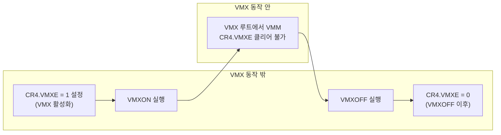

# Intel® 64 및 IA-32 아키텍처 소프트웨어 개발자 설명서, 볼륨 3C 

## 25.1 개요(Overview)

이 장에서는 가상 머신 아키텍처의 기본 개념과, 여러 소프트웨어 환경을 위해 프로세서 하드웨어의 가상화를 지원하는 **VMX (Virtual-machine Extensions)**에 대한 개요를 설명한다.

VMX 명령에 대한 정보는 *Intel® 64 and IA-32 Architectures Software Developer’s Manual, Volume 2B*에 수록되어 있다. VMX의 다른 측면과 시스템 프로그래밍상의 고려 사항은 *Intel® 64 and IA-32 Architectures Software Developer’s Manual, Volume 3C*의 각 장에서 다룬다.


## 25.2 가상 머신 아키텍처(Virtual Machine Architecture)

**VMX (Virtual-machine Extensions)**는 **IA-32 (Intel Architecture 32-bit)** 프로세서에서 **VM (Virtual Machine)**에 대한 프로세서 수준 지원을 정의한다. 두 가지 주요 소프트웨어 범주가 지원된다.

- **가상 머신 모니터 — VMM (Virtual-machine Monitor):** VMM은 호스트 역할을 하며 프로세서(들) 및 기타 플랫폼 하드웨어에 대한 완전한 제어 권한을 갖는다. VMM은 게스트 소프트웨어(다음 항목 참고)에게 가상 프로세서의 추상화를 제공하고, 논리 프로세서에서 직접 실행되도록 한다. VMM은 프로세서 자원, 물리 메모리, 인터럽트 관리, **I/O (Input/Output)**에 대해 선택적으로 제어를 유지할 수 있다.

- **게스트 소프트웨어 — Guest software:** 각 **VM (Virtual Machine)**은 **OS (Operating System)**와 응용 소프트웨어로 구성된 스택을 지원하는 게스트 소프트웨어 환경이다. 각 VM은 다른 VM들과 독립적으로 동작하며, 물리 플랫폼이 제공하는 프로세서(들), 메모리, 저장 장치, 그래픽, **I/O (Input/Output)**에 대한 **동일한** 인터페이스를 사용한다. 소프트웨어 스택은 VMM이 없는 플랫폼에서 실행되는 것처럼 동작한다. VM에서 실행되는 소프트웨어는 VMM이 플랫폼 자원의 제어를 유지할 수 있도록 **낮은(제한된) 권한**으로 동작해야 한다.

## 25.3 VMX 동작 소개(Introduction to VMX Operation)

가상화에 대한 프로세서 지원은 **VMX 동작 — VMX operation**이라는 형태의 프로세서 동작으로 제공된다.

**VMX (Virtual-machine Extensions)** 동작에는 두 종류가 있다: 
**VMX 루트 동작 — VMX root operation**과 **VMX 논루트 동작 — VMX non-root operation**. 

일반적으로 **VMM (Virtual-machine Monitor)**은 VMX 루트 동작에서 실행되고, 게스트 소프트웨어는 VMX 논루트 동작에서 실행된다. 
VMX 루트 동작과 VMX 논루트 동작 사이의 전환을 **VMX 전환 — VMX transitions**이라 한다. 

VMX 전환에는 두 종류가 있다. 

VMX 논루트 동작으로 들어가는 전환을 **VM 진입 — VM entries**이라 하고, VMX 논루트 동작에서 VMX 루트 동작으로 나오는 전환을 **VM 종료 — VM exits**라 한다.


VMX 루트 동작에서의 프로세서 동작은 VMX 동작 밖에서와 매우 유사하다. 
주된 차이는 (1) 새로운 명령 집합인 **VMX 명령 — VMX instructions**을 사용할 수 있다는 점과, (2) 특정 제어 레지스터에 적재할 수 있는 값이 제한된다는 점(25.8절 참고)이다.

VMX 논루트 동작에서의 프로세서 동작은 가상화를 용이하게 하기 위해 **제한되고 변경**된다. 

일반적인 동작 대신, 특정 명령(새로운 **VMCALL (VM Call)** 명령 포함)과 이벤트는 **VMM (Virtual-machine Monitor)**으로의 **VM 종료 — VM exit**를 유발한다. 
이러한 VM 종료가 일반 동작을 대체하기 때문에, VMX 논루트 동작에서의 소프트웨어 기능은 제한된다. 

바로 이 제한 덕분에 **VMM (Virtual-machine Monitor)**이 프로세서 자원에 대한 제어를 유지할 수 있다.


논리 프로세서가 VMX 논루트 동작에 있는지 여부를 나타내는 **소프트웨어에 보이는 비트 — software-visible bit**는 없다. 
이 사실은 **VMM (Virtual-machine Monitor)**이 게스트 소프트웨어가 자신이 **VM (Virtual Machine)**에서 실행 중임을 판별하지 못하게 하는 데 활용될 수 있다. VMX 동작은 **CPL (Current Privilege Level) 0**에서 실행되는 소프트웨어에도 제한을 가하므로, 게스트 소프트웨어는 원래 설계된 권한 레벨에서 실행할 수 있다. 이 능력은 **VMM (Virtual-machine Monitor)** 개발을 단순화할 수 있다.

## 25.4 VMM 소프트웨어의 생명 주기(Life Cycle of VMM Software)

그림 25-1은 **VMM (Virtual-machine Monitor)**과 그 게스트 소프트웨어의 생명 주기와, 둘 사이의 상호작용을 나타낸다. 그 생명 주기는 다음과 같이 요약할 수 있다.
- 소프트웨어는 **VMXON** 명령을 실행하여 **VMX 동작 — VMX operation**에 진입한다.


- **VM 진입 — VM entries**를 사용하여 **VMM**은 게스트를 가상 머신으로 들어가게 할 수 있다(한 번에 하나씩).
 VMM은 **VMLAUNCH**와 **VMRESUME** 명령으로 VM 진입을 수행하고, **VM 종료 — VM exits**로 제어를 되찾는다.

- VM 종료는 VMM이 지정한 진입점으로 제어를 넘긴다. VMM은 VM 종료 원인에 맞는 처리를 한 뒤, 다시 VM 진입을 통해 가상 머신으로 돌아갈 수 있다.

- 마침내 VMM은 스스로를 종료하고 VMX 동작을 벗어나기로 결정할 수 있다. 그때 **VMXOFF** 명령을 실행한다.


## 25.5 가상 머신 제어 구조(Virtual-Machine Control Structure)

**VMX 논루트 동작 — VMX non-root operation**과 **VMX 전환 — VMX transitions**은 **가상 머신 제어 구조 — virtual-machine control structure (VMCS)**라는 데이터 구조에 의해 제어된다.

**VMCS**에 대한 접근은 **VMCS 포인터 — VMCS pointer**(논리 프로세서당 하나)라고 하는 프로세서 상태의 한 구성 요소를 통해 관리된다. 
VMCS 포인터의 값은 VMCS의 64비트 주소이다. 
VMCS 포인터는 **VMPTRST**와 **VMPTRLD** 명령으로 읽고 쓴다. 
VMM은 **VMREAD**, **VMWRITE**, **VMCLEAR** 명령으로 VMCS를 구성한다.

VMM은 지원하는 가상 머신마다 서로 다른 VMCS를 사용할 수 있다. 
여러 논리 프로세서(가상 프로세서)를 갖는 가상 머신의 경우, VMM은 가상 프로세서마다 서로 다른 VMCS를 사용할 수 있다.


## 25.6 VMX 지원 탐지(Discovering Support for VMX)

시스템 소프트웨어가 VMX 동작에 들어가기 전에, 프로세서에 VMX 지원이 있는지 확인해야 한다. 
소프트웨어는 **CPUID**로 프로세서가 VMX 동작을 지원하는지 판별할 수 있다. 

**CPUID.1:ECX.VMX[bit 5] = 1**이면 VMX 동작이 지원된다. 
*Intel® 64 and IA-32 Architectures Software Developer’s Manual, Volume 2A*의 3장, “Instruction Set Reference, A–L”을 보라.

**VMX** 아키텍처는 확장 가능하도록 설계되어 있어, 향후 프로세서는 VMX 동작에서 초기 세대 VMX 구현에 없는 추가 기능을 지원할 수 있다. 

확장 가능한 VMX 기능의 제공 여부는 **VMX 기능 MSR — VMX capability MSRs** 집합을 통해 소프트웨어에 보고된다(부록 A, “VMX Capability Reporting Facility” 참고).

## 25.7 VMX 동작 활성화 및 진입(Enabling and Entering VMX Operation)

시스템 소프트웨어가 VMX 동작에 들어가기 전에, **CR4.VMXE[bit 13] = 1**로 설정하여 VMX를 활성화한다. 

그다음 **VMXON** 명령을 실행하면 VMX 동작에 진입한다. 

**CR4.VMXE = 0**인 상태에서 **VMXON**을 실행하면 **잘못된 opcode 예외 — invalid-opcode exception (#UD)**가 발생한다. 

VMX 동작에 들어간 뒤에는 **CR4.VMXE**를 지울 수 없다(25.8절 참고). 

시스템 소프트웨어는 **VMXOFF** 명령을 실행하여 VMX 동작을 벗어난다. 
**VMXOFF** 실행 이후, VMX 동작 밖에서는 **CR4.VMXE**를 지울 수 있다.

### 추가 설명: `CR4.VMXE`와 `VMXON`/`VMXOFF`의 역할 분리

- **`CR4.VMXE`:** “VMX 관련 명령을 **해석·허용**할 하드웨어 맥락을 켠다”는 뜻에 가깝다. 이 비트가 0이면 **VMXON**은 아예 **#UD**로 막힌다.
- **`VMXON`:** 그 위에서 실제로 **VMX 동작(주로 VMX 루트)**에 들어간다. 들어간 뒤에는 같은 이유로 **CR4.VMXE**를 0으로 되돌리는 동작이 막힌다(25.8절).
- **`VMXOFF`:** VMX 동작을 종료한다. 그 다음에야 **VMX 동작 밖**으로 돌아가므로, 그때 **`CR4.VMXE`를 클리어**할 수 있다.

아래 그림은 “비트 설정”과 “VMX 동작 진입/이탈”이 **단계가 다르다**는 점을 강조한다.



실제 시스템 소프트웨어는 **CPUID(25.6절)**, **`IA32_FEATURE_CONTROL`(아래 목록)**, **VMXON 영역 준비·초기화**, **CR0/CR4 고정 비트 정렬(25.8절)** 등을 먼저 만족시킨 뒤 위 순서를 밟는다. 
아래는 그 **골격만** 보여 주는 의사 코드이다(주소·오류 처리·인터럽트 비활성화 등은 생략).

```c
/* 의사 코드: 개념적 순서: 활성화 → VMXON → … → VMXOFF → CR4 정리 */
#define CR4_VMXE  (1u << 13)

void prepare_platform_for_vmx(void)
{
    /* CPUID.ECX.VMX, IA32_FEATURE_CONTROL, CR0/CR4 고정 MSR 등 점검 */
    /* VMXON 영역(4KB, 자연 정렬) 할당·초기화 — 본 절 아래 및 26.11.5절 */
}

void enable_vmx_in_cr4(void)
{
    write_cr4(read_cr4() | CR4_VMXE);  /* VMX 명령 해석 허용 */
}

void enter_vmx_operation(uint64_t vmxon_region_pa)
{
    vmxon(vmxon_region_pa);             /* 이 시점부터 VMX 동작(루트) */
}

void leave_vmx_operation(void)
{
    vmxoff();                           /* VMX 동작 종료 */
    write_cr4(read_cr4() & ~CR4_VMXE);  /* VMXOFF 이후에만 허용되는 정리 */
}
```

**VMXON**은 **IA32_FEATURE_CONTROL** MSR(MSR 주소 **3AH**)에 의해서도 제어된다. 
이 MSR은 논리 프로세서가 리셋될 때 0으로 지워진다. 이 MSR의 관련 비트는 다음과 같다.

- **비트 0**은 **잠금 비트 — lock bit**이다. 
이 비트가 지워져 있으면 **VMXON**은 **일반 보호 예외 — general-protection exception**을 유발한다. 

잠금 비트가 설정되어 있으면, 이 MSR에 대한 **WRMSR**은 일반 보호 예외를 유발한다. 

전원 인가 리셋 조건이 될 때까지 이 MSR은 수정할 수 없다. 

시스템 BIOS는 이 비트를 사용하여 BIOS가 VMX 지원을 끄는 설정 옵션을 제공할 수 있다. 

플랫폼에서 VMX 지원을 켜려면, BIOS는 아래 비트 1, 비트 2, 또는 둘 다(아래 참고)와 함께 잠금 비트도 설정해야 한다.


- **비트 1**은 **SMX 동작 — SMX operation**에서의 **VMXON**을 허용한다. 
이 비트가 지워져 있으면, SMX 동작에서 **VMXON** 실행은 일반 보호 예외를 유발한다. 

**VMX 동작**(25.6절 참고)과 **SMX 동작**을 모두 지원하지 않는 논리 프로세서에서 이 비트를 설정하려는 시도는 일반 보호 예외를 유발한다(SMX 동작은 *Intel® 64 and IA-32 Architectures Software Developer’s Manual, Volume 2D*의 7장, “Safer Mode Extensions Reference” 참고).

- **비트 2**는 SMX 동작 밖에서의 **VMXON**을 허용한다. 
이 비트가 지워져 있으면, SMX 동작 밖에서 **VMXON** 실행은 일반 보호 예외를 유발한다. 
VMX 동작을 지원하지 않는 논리 프로세서에서 이 비트를 설정하려는 시도는 일반 보호 예외를 유발한다(25.6절 참고).

**참고:** 논리 프로세서가 마지막 **GETSEC[SENTER]** 실행 이후 **GETSEC[SEXIT]**이 실행되지 않았다면 SMX 동작에 있다. 

**GETSEC[SENTER]**가 실행되지 않았거나, 마지막 **GETSEC[SENTER]** 이후 **GETSEC[SEXIT]**가 실행되었다면 SMX 동작 밖에 있다. *Intel® 64 and IA-32 Architectures Software Developer’s Manual, Volume 2D*의 7장, “Safer Mode Extensions Reference”를 보라.

**VMXON**을 실행하기 전에, 소프트웨어는 논리 프로세서가 VMX 동작을 지원하는 데 사용할 수 있는 **자연 정렬 — naturally aligned** **4KB** 메모리 영역을 할당해야 한다. 

이 영역을 **VMXON 영역 — VMXON region**이라 한다. 

VMXON 영역의 주소(**VMXON 포인터 — VMXON pointer**)는 **VMXON**의 오퍼랜드로 제공된다. 
26.11.5절, “VMXON Region”에서 VMXON 영역을 어떻게 초기화하고 접근해야 하는지 자세히 설명한다.


### VMXON 영역에 대한 추가 설명

- **역할:** 

**VMXON**에 성공하면 논리 프로세서는 VMX 동작(보통 **VMX 루트**)에 들어가며, 이때 프로세서는 **VMXON 영역**을 **VMX 동안 유지되는 VMX 루트 관련 상태**를 두는 데 사용한다

(포맷의 상당 부분은 **구현 고유 — implementation-specific**이며, 소프트웨어는 매뉴얼이 요구하는 범위만 초기화하고 나머지는 **예약 필드를 0으로 유지**하는 식으로 다룬다).

이는 **VMCS**를 설정·실행하기 위한 또 하나의 **4KB** 구조물과는 **목적이 다른 별도의 영역**이다.

- **크기·정렬:** 기본적으로 **4096바이트(4KB)**이고, 시작 **물리 주소**가 **4KB 경계에 맞춰져 있어야 한다**(자연 정렬). 

**VMXON** 오퍼랜드로 넘기는 값은 모드에 따라 **물리 주소**로 해석되는데, 세부는 26.11.5절 및 **VMXON** 명령 설명(32장)을 따른다.

- **초기화(요지):** 실행 직전에 소프트웨어는 보통 다음을 만족시킨다.
  1. **IA32_VMX_BASIC** MSR(인덱스 **480H**)에 보고된 **VMCS 리비전 식별자 — VMCS revision identifier**를 읽는다.
  
  2. **VMXON 영역의 첫 4바이트**에 그 식별자를 기록하되, **비트 31은 0**으로 둔다(매뉴얼 표현: 첫 4바이트의 **비트 30:0**에 리비전, **비트 31** 클리어).
  
  3. **나머지 영역(대부분의 4KB)**은 **0으로 채운다**(예약 필드·미사용 바이트를 소프트웨어가 의미 있게 쓰는 용도가 아님).

- **접근·캐시:** 영역은 프로세서가 VMX 동작 중 **읽고 쓸 수 있어야** 하며, **캐시 속성·메모리 타입**(예: WB 등)에 대한 요구는 매뉴얼 26.11.5절 및 플랫폼 규칙을 따른다. 잘못된 타입이면 **VMXON**이 실패하거나 이후 동작이 비정상일 수 있다.

- **수명:** **VMXOFF**로 VMX 동작을 벗어난 뒤에 다시 **VMXON**을 하려면, 해당 논리 프로세서에 대해 **매뉴얼이 요구하는 초기화 절차**를 다시 밟아야 한다(이미 한 번 썼던 영역을 그대로 재사용할 때도 **리비전·클리어 조건**을 다시 맞추는지는 26.11.5절·32장을 본다).

**참고:** 향후 프로세서는 예약해야 할 메모리 양이 달라질 수 있다. 그 경우 이 사실은 **VMX 기능 보고 메커니즘 — VMX capability-reporting mechanism**을 통해 소프트웨어에 보고된다.

## 25.8 VMX 동작에 대한 제한(Restrictions on VMX Operation)

VMX 동작은 프로세서 동작에 제한을 둔다. 아래에 자세히 설명한다.

- VMX 동작에서 프로세서는 **CR0**와 **CR4**의 특정 비트를 특정 값으로 **고정 — fix**할 수 있으며, 다른 값은 지원하지 않을 수 있다.

이러한 비트 중 하나라도 지원되지 않는 값을 갖고 있으면 **VMXON**이 실패한다(32장의 “VMXON—Enter VMX Operation” 참고). 
VMX 동작(**VMX 루트 동작 — VMX root operation** 포함) 중 **CLTS**, **LMSW**, **MOV CR** 명령으로 이러한 비트 중 하나를 지원되지 않는 값으로 설정하려는 시도는 일반 보호 예외를 유발한다. 

**VM 진입 — VM entry**나 **VM 종료 — VM exit**는 이러한 비트를 지원되지 않는 값으로 설정할 수 없다. 

**CR0**의 비트가 어떻게 고정되는지는 VMX 기능 MSR **IA32_VMX_CR0_FIXED0**과 **IA32_VMX_CR0_FIXED1**을 참고해야 한다(부록 A.7). 

**CR4**에 대해서는 **IA32_VMX_CR4_FIXED0**과 **IA32_VMX_CR4_FIXED1**을 참고해야 한다(부록 A.8).

**참고:** 
VMX 동작을 지원한 최초의 프로세서들은 VMX 동작에서 다음 비트가 1이어야 한다고 요구한다: 
**CR0.PE**, **CR0.NE**, **CR0.PG**, **CR4.VMXE**. **CR0.PE**와 **CR0.PG**에 대한 제한은 VMX 동작이 **페이지 보호 모드 — paged protected mode**(**IA-32e 모드 — IA-32e mode** 포함)에서만 지원됨을 의미한다. 

따라서 게스트 소프트웨어는 **비페이지 보호 모드 — unpaged protected mode**나 **실주소 모드 — real-address mode**에서 실행될 수 없다.

**참고:** 후속 프로세서는 “**제한 없는 게스트 — unrestricted guest**”라는 **VM 실행 제어 — VM-execution control**(26.6.2절 참고)을 지원한다. 이 제어가 1이면, VMX 논루트 동작에서 **CR0.PE**와 **CR0.PG**가 0일 수 있다(기능 MSR **IA32_VMX_CR0_FIXED0**이 달리 보고하는 경우에도). 이러한 프로세서는 게스트 소프트웨어가 비페이지 보호 모드나 실주소 모드에서 실행되도록 허용한다.

- 논리 프로세서가 **A20M 모드 — A20M mode**에 있으면 **VMXON**이 실패한다(32장의 “VMXON—Enter VMX Operation” 참고). 프로세서가 VMX 동작에 들어간 뒤에는 **A20M** 인터럽트가 차단된다. 따라서 VMX 동작 중에 A20M 모드에 있을 수는 없다.
- 논리 프로세서가 **VMX 루트 동작**에 있는 동안에는 **INIT** 신호가 차단된다. **VMX 논루트 동작**에서는 차단되지 않는다. 대신 **INIT**은 VM 종료를 유발한다(27.2절, “Other Causes of VM Exits” 참고).
- **Intel® Processor Trace (Intel PT)**는 **IA32_VMX_MISC[14]**를 읽었을 때 1인 경우에만 VMX 동작에서 사용할 수 있다(부록 A.6). Intel PT는 지원하지만 VMX 동작에서의 사용을 허용하지 않는 프로세서에서는 **VMXON** 실행이 **IA32_RTIT_CTL.TraceEn**을 지운다(32장의 “VMXON—Enter VMX Operation” 참고). VMX 동작(VMX 루트 동작 포함) 중 **IA32_RTIT_CTL**에 쓰려는 시도는 일반 보호 예외를 유발한다.

## 26.1 개요(Overview)

논리 프로세서는 **VMX 동작 — VMX operation**에 있는 동안 **가상 머신 제어 데이터 구조 — virtual-machine control data structures (VMCSs)**를 사용한다. 

이 구조들은 **VMX 논루트 동작 — VMX non-root operation**으로의 진입과 그로부터의 이탈(**VM 진입 — VM entries**, **VM 종료 — VM exits**)을 관리할 뿐 아니라, VMX 논루트 동작에서의 프로세서 동작도 관리한다. 

이 구조는 **VMCLEAR**, **VMPTRLD**, **VMREAD**, **VMWRITE** 등 새로운 명령으로 조작된다.

**VMM (Virtual-machine Monitor)**은 지원하는 가상 머신마다 서로 다른 VMCS를 사용할 수 있다. 
여러 논리 프로세서(가상 프로세서)를 갖는 가상 머신의 경우, VMM은 가상 프로세서마다 서로 다른 VMCS를 사용할 수 있다.

논리 프로세서는 각 VMCS마다 메모리 안의 한 영역을 연결한다. 
이 영역을 **VMCS 영역 — VMCS region**이라 한다. 

소프트웨어는 해당 영역의 **64비트 물리 주소**(즉 **VMCS 포인터 — VMCS pointer**)로 특정 VMCS를 가리킨다. 
VMCS 포인터는 **4KB 경계에 정렬**되어 있어야 한다(**비트 11:0은 0**이어야 한다). 
또한 이 포인터는 프로세서의 **물리 주소 폭**을 넘는 비트를 설정해서는 안 된다.

**참고:**
- VMCS 영역에 필요한 메모리는 **최대 4KB**이다. 정확한 크기는 **구현 고유**이며, VMCS 영역 크기는 VMX 기능 MSR **IA32_VMX_BASIC**으로 확인할 수 있다(부록 A.1).

- 프로세서의 물리 주소 폭은 **CPUID**를 **EAX = 80000008H**로 실행해 알 수 있으며, **EAX의 비트 7:0**에 반환된다.

- **IA32_VMX_BASIC[48]**가 1로 읽히면, VMCS 포인터는 **비트 63:32**를 설정해서는 안 된다(부록 A.1 참고).

논리 프로세서는 여러 개의 VMCS를 **활성(active)** 상태로 유지할 수 있다. 
프로세서는 활성 VMCS의 상태를 메모리와 프로세서 중 한쪽 또는 둘 다에 두는 방식으로 VMX 동작을 최적화할 수 있다.

어떤 시점에서도, 활성 VMCS 중 **현재 VMCS — current VMCS**는 **최대 하나**뿐이다. 
(이 문서에서는 종종 “the VMCS”라고 하면 **현재 VMCS**를 가리킨다.) 

**VMLAUNCH**, **VMREAD**, **VMRESUME**, **VMWRITE** 명령은 **현재 VMCS**에만 동작한다.

활성 VMCS와 현재 VMCS가 어떻게 결정되는지는 다음과 같다.

- **VMPTRLD** 명령의 메모리 오퍼랜드는 한 VMCS의 주소이다. 
이 명령을 실행한 뒤에는 그 VMCS가 논리 프로세서에서 **활성이면서 현재**가 된다. 
그 전에 활성이었던 다른 VMCS는 여전히 **활성**일 수 있지만, **현재**인 다른 VMCS는 없다.

- 현재 VMCS 안의 **VMCS 링크 포인터 — VMCS link pointer** 필드(26.4.2절 참고)는 그 자체가 다른 VMCS의 주소이다. 

**“VMCS 섀도잉 — VMCS shadowing”** VM 실행 제어가 1로 설정된 상태에서 VM 진입이 성공하면, VMCS 링크 포인터가 가리키는 VMCS가 논리 프로세서에서 **활성**이 된다. 

**현재 VMCS**의 정체는 바뀌지 않는다.

- **VMCLEAR** 명령의 메모리 오퍼랜드 역시 한 VMCS의 주소이다. 

이 명령을 실행한 뒤에는 그 VMCS는 논리 프로세서에서 **활성도 아니고 현재도 아니다**. 

그 VMCS가 논리 프로세서에서 **현재**였다면, 논리 프로세서는 더 이상 **현재 VMCS**를 갖지 않게 된다.

**VMPTRST** 명령은 논리 프로세서의 **현재 VMCS** 주소를 지정된 메모리 위치에 저장한다(**현재 VMCS가 없으면** `FFFFFFFF_FFFFFFFFH`를 저장한다).

VMCS의 **실행 상태 — launch state**는 해당 VMCS와 함께 어떤 VM 진입 명령을 써야 하는지를 결정한다: 

**VMLAUNCH**는 실행 상태가 **“클리어 — clear”**인 VMCS가 필요하고, **VMRESUME**은 **“실행됨 — launched”**인 VMCS가 필요하다. 

논리 프로세서는 해당 VMCS 영역에 VMCS의 실행 상태를 유지한다. 

실행 상태는 다음처럼 관리된다.

- 현재 VMCS의 실행 상태가 **“clear”**일 때, **VMLAUNCH**가 성공하면 그 VMCS의 실행 상태는 **“launched”**로 바뀐다.

- **VMCLEAR**의 메모리 오퍼랜드가 가리키는 VMCS에 대해서는, 명령 실행 후 그 VMCS의 실행 상태는 **“clear”**가 된다.

실행 상태를 바꾸는 **다른 방법은 없다**(**VMWRITE**로 수정할 수 없으며), 직접 읽어 알아내는 방법도 없다(**VMREAD**로 읽을 수 없다).

**그림 26-1**은 VMCS의 여러 상태를 나타낸다. 
여기서 **“X”**는 해당 VMCS를, **“Y”**는 그 밖의 임의의 VMCS를 가리킨다. 

따라서 **VMPTRLD X**는 항상 X를 **현재이면서 활성**으로 만든다; 

**VMPTRLD Y**는 항상 X를 **현재가 아니게** 만든다(Y가 현재가 되므로); 
X가 현재이고 실행 상태가 clear였다면 **VMLAUNCH**는 X의 실행 상태를 **launched**로 바꾼다; 
**VMCLEAR X**는 항상 X를 **비활성·비현재·clear**로 만든다.

그림은 이 매개변수들과 관련해 VMCS 상태를 바꾸지 않는 동작(예: X가 이미 현재일 때 **VMPTRLD X** 실행)은 보여 주지 않는다. **VMCLEAR X**는 X의 “현재” 여부가 정의되지 않은 경우(예: 아직 초기화되지 않았을 때)에도 X를 **비활성·비현재·clear**로 만든다는 점에 유의한다(26.11.3절 참고).

**섀도 VMCS — shadow VMCS**(26.10절 참고)는 VM 진입에 사용할 수 없으므로, 섀도 VMCS의 실행 상태는 의미가 없다. 

그림 26-1은 섀도 VMCS가 활성화될 수 있는 모든 경우를 다 보여 주지는 않는다.

## 26.2 VMCS 영역의 형식(Format of the VMCS Region)

**VMCS 영역 — VMCS region**은 **최대 4KB**까지 차지한다. VMCS 영역의 형식은 **표 26-1**과 같다.

**표 26-1. VMCS 영역의 형식**

| 바이트 오프셋 | 내용 |
|---------------|------|
| **0** | **비트 30:0:** **VMCS 리비전 식별자 — VMCS revision identifier**<br>**비트 31:** **섀도 VMCS 표시 — shadow-VMCS indicator**(26.10절 참고) |
| **4** | **VMX 중단 표시 — VMX-abort indicator** |
| **8** | **VMCS 데이터 — VMCS data**(**형식은 구현 고유 — implementation-specific format**) |

**참고:** 정확한 크기는 **구현 고유**이며, VMCS 영역 크기는 VMX 기능 MSR **IA32_VMX_BASIC**을 참고해 확인할 수 있다(부록 A.1).

VMCS 영역의 **첫 4바이트**에는 **비트 30:0**에 **VMCS 리비전 식별자**가 들어간다. 

서로 다른 형식으로 VMCS 데이터를 유지하는 프로세서는 서로 다른 VMCS 리비전 식별자를 사용한다. 

이 식별자 덕분에 소프트웨어는 **한 프로세서용으로 포맷된 VMCS 영역**을 **다른 형식을 쓰는 프로세서**에서 쓰는 실수를 피할 수 있다. 

이 4바이트의 **비트 31**은 해당 VMCS가 **섀도 VMCS**인지 여부를 나타낸다(26.10절).

소프트웨어는 VMCS로 해당 영역을 쓰기 **전에** VMCS 영역에 **VMCS 리비전 식별자**를 기록해야 한다. 

**VMCS 리비전 식별자는 프로세서가 쓰지 않는다**; 

**VMPTRLD**는 오퍼랜드가 가리키는 VMCS 영역의 VMCS 리비전 식별자가 **이 프로세서가 사용하는 값과 다르면** 실패한다. 
(**섀도 VMCS 표시**가 1인데 프로세서가 **“VMCS 섀도잉 — VMCS shadowing”** VM 실행 제어의 1-설정을 지원하지 않는 경우에도 **VMPTRLD**는 실패한다; 26.6.2절 참고.) 소프트웨어는 VMX 기능 MSR **IA32_VMX_BASIC**을 읽어 해당 프로세서가 사용하는 **VMCS 리비전 식별자**를 알 수 있다(부록 A.1).

소프트웨어는 VMCS가 **일반 VMCS**인지 **섀도 VMCS**인지에 따라 **섀도 VMCS 표시**를 클리어하거나 설정해야 한다(26.10절). 
**섀도 VMCS 표시**가 설정되어 있는데 프로세서가 **“VMCS 섀도잉”** VM 실행 제어의 1-설정을 지원하지 않으면 **VMPTRLD**는 실패한다. 이 설정에 대한 지원 여부는 VMX 기능 MSR **IA32_VMX_PROCBASED_CTLS2**로 확인할 수 있다(부록 A.3.3).

VMCS 영역의 **다음 4바이트**(오프셋 4)는 **VMX 중단 표시 — VMX-abort indicator**에 쓰인다. 이 비트들의 내용은 **어떤 방식으로도** 프로세서 동작을 제어하지 않는다. **VMX 중단 — VMX abort**가 발생하면 논리 프로세서는 이 비트들에 **0이 아닌 값**을 기록한다(29.7절 참고). 소프트웨어가 이 필드에 쓰는 것도 허용된다.

VMCS 영역의 **나머지**는 **VMCS 데이터**에 사용된다(VMX 논루트 동작과 VMX 전환을 제어하는 VMCS의 그 부분). 이 데이터의 형식은 **구현 고유**이다. VMCS 데이터는 **26.3절부터 26.9절**까지 다룬다. VMX 동작에서 바르게 동작하려면 소프트웨어는 VMCS 영역과 관련 구조(26.11.4절에 열거됨)를 **쓰기-백 캐시 가능 — writeback cacheable** 메모리로 유지해야 한다. 향후 구현에서는 **다른 메모리 타입**을 허용하거나 요구할 수 있다. 소프트웨어는 VMX 기능 MSR **IA32_VMX_BASIC**을 참고해야 한다(부록 A.1).


